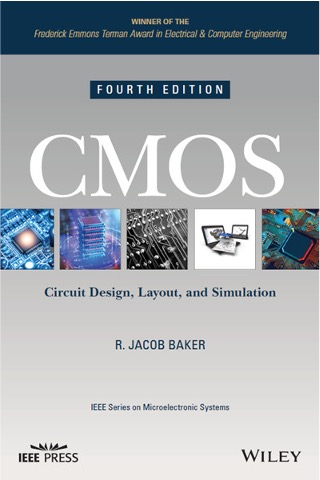

**VLSI Design**

**Homework 1**

**Due Date:** Feb. 12, 2026 @ 1:15pm

**Description:** This assignment will survey what you have learned thus far using problems from R. Baker’s “CMOS Circuit Design, Layout, and Simulation”

**Associated Reading Material:
*** Chapters 5 (Sections 5.1-5.3), 6 (Entire Chapter), 7 (Entire Chapter), 11 (Sections 11.1-11.3), and 12 (Sections 12.1-12.3)

**Problems**:

5.7 (Layout-to-Schematic Analysis)

6.4 (MOS capacitance)

6.12 (Channel resistance)

6.13 (Parallel MOSFET Connections)

6.15 (Series MOSFET Connections)

7.4 (Ion Implantation)

7.10 (Metal Deposition)

11.1 (Inverter DC Characteristics)

11.3 (Inverter Switching Point)

12.2 (Logic Gate Design and Simulation)

**Deliverables:** Create a single PDF document highlighting all results and showing supporting work. Submit via Canvas no later than Feb. 12 at 1:15 pm.